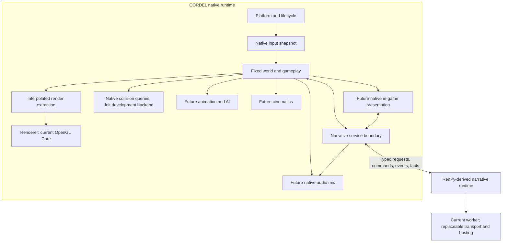

# CORDEL architecture

Status: **accepted runtime/narrative ownership architecture** under
[ADR 0001](adr/0001-runtime-narrative-ownership.md), dated 2026-10-08.
The [Phase 1 conclusion](PHASE_1_ARCHITECTURE_DECISION.md) indexes fresh validation.
Production subsystems below remain future work unless their reference implementation
is explicitly named. CORDEL focuses on cinematic third-person narrative games.

## Accepted decisions

**CORDEL is a native real-time engine with an independent narrative service
boundary. Ren'Py contributes narrative technology; it does not own CORDEL.**

| Decision | Status |
| --- | --- |
| Runtime authority | Native CORDEL owns lifecycle, platform/input, clock, world/scene/camera, gameplay, rendering/GPU resources and future physics/animation/AI/cinematics |
| Narrative contract | Accepted: explicit transport-independent typed requests, commands/results, events, facts, checkpoints and cancellation using stable IDs |
| Current narrative hosting | Native runtime + isolated Ren'Py worker is the default/reference implementation for subsequent development; permanent two-process shipping is not required |
| Embedded Ren'Py/Python | Deferred candidate optimization/deployment architecture; no GIL/lifecycle/ABI/reentrancy/restart evidence yet |
| Ren'Py-primary runtime | Rejected for production real-time 3D world ownership; retain original application/source as the behavioral reference |
| Narrative rewrite/replacement | Rejected for current scope; reconsider only with measured adapter-maintenance cost exceeding replacement of the supported subset |
| Development renderer | OpenGL Core, executed C++20/SDL3 native reference |
| Production renderer | Undecided; no permanent OpenGL/API commitment |
| Collision query backend | Jolt selected for native development under ADR 0002; Bullet remains separately tested; query motor software gate passed; dynamic physics/production motor/platform qualification pending |
| Production presentation/audio | CORDEL owns in-game UI/input routing and future real-time audio device/world mix; narrative supplies semantic cues |

[Source audit](ARCHITECTURE_AUDIT.md) and executed [1.1](PHASE_1_1_VIEWPORT.md),
[1.2](PHASE_1_2_NATIVE_HOST.md), [1.3](PHASE_1_3_NARRATIVE_OWNERSHIP.md) experiments
support this decision. Ren'Py rendered a meaningful continuously updated viewport,
but simulation followed render invalidation, assets followed prediction/cache,
and gameplay shared UI input and virtual-screen assumptions. Native ownership
proved independent fixed ticking/interpolation and explicit GL deletion. The real
AST worker waits/branches/fails while the world retains its clock and resources.

These are software, tiny-fixture results. Native authority does not eliminate
single-thread GL stalls: per-frame diagnostic glFinish bounds submissions, and
SDL offscreen resize recreates an EGL surface. Neither is a production GPU queue
or visible desktop test. The worker still loads Ren'Py globals/common scripts and
SDK modules, uses explicit dynamic-context cleanup, and lacks full Character,
localization, UI/audio and save compatibility. All device/hardware, durable-save,
other-OS transport and long-soak gates remain open. Historical experiment reports
retain their original recommendations; ADR 0001 is the current decision authority.

## Accepted ownership and future subsystem boundaries

All subsystem contracts start as internal interfaces. A stable public plugin ABI
is premature. No dependency is introduced merely to make this diagram real.

| System | Responsibilities and initial interface direction |
| --- | --- |
| Core runtime | Create/configure/run/suspend/shutdown; monotonic clocks, fixed update accumulator, job budgets, diagnostics, allocator/resource accounting, platform services. Ordered startup with rollback of partial initialization |
| Rendering | Consume immutable scene/view packets; own GPU resources, uploads, completion fences, resize/device recovery. Camera/mesh/material/light handles; capability query. Eventually PBR, shadows, HDR, post-processing; advanced features only after profiling |
| Scene | Stable entity IDs with generation checks, parented local/world transforms, sparse typed components, scene instantiate/destroy, serialization and reference repair. Enforce acyclic hierarchy and consistent units |
| Characters/animation | Character motor distinct from rendering; locomotion parameters, root-motion policy, skeletal pose buffers, state-machine transitions, blend trees, retargeting and IK layers. Physics and animation agree on authoritative motion |
| Physics | `step`, queries/raycast, shape/body/trigger handles, collision-layer filters and ordered contact events. Character sweeps/traversal are gameplay-visible; no pointers exposed to scripts |
| Gameplay | Player action processing, interaction queries, object/encounter state machines, gameplay events and future combat. Engine services separated from game-specific weapon/rule logic |
| Narrative | Run a label/session, supply immutable world facts, emit commands and dialogue/choice requests, acknowledge waits, checkpoint/restore story state. Preserve localization IDs and compatible reference behavior where deliberately supported |
| Cinematics | Time-based tracks for cameras, poses, dialogue and events; bindings by stable IDs; enter/seek/skip/exit with explicit ownership handoff and interruption policy |
| Audio | One ownership layer for voice/music/world emitters; listener poses, buses/mixing, asset handles, playback clocks and cue acknowledgments. Resolve duplicate device/mixer ownership before embedding Ren'Py |
| AI | Navigation data/queries, perception stimuli, behavior/state evaluation, encounter control and animation requests. Budget updates; gameplay remains authoritative over decisions |
| Assets | Source manifest, stable IDs, import/cook/cache with dependency hashes, versioned runtime data, streaming/residency and packaging. Separate authoring formats from runtime formats |
| Editor | Scene/lighting/character placement, asset browser, inspectors, undo transactions, play-in-editor isolation, cinematic timeline and narrative debug state. Use the same scene/asset schemas as runtime |
| Platform | Desktop window/surface/input/files/timing/threading, suspend and capabilities. Preserve portable interfaces; Linux/Windows first, macOS after a viable backend route; other platforms require separate evaluation |

### Scheduling, memory and ownership

Accepted frame order: platform events → native action snapshot → bounded narrative
message pump → fixed world ticks (gameplay / future physics / AI / command application)
→ animation/cinematic state → interpolated render extraction → renderer submission
→ presentation → bounded service/background work. Commands mutate world only on its
authoritative thread/boundary; an I/O callback cannot apply them. Pause/resume/cancel
and checkpoint control use an explicit world-thread safe boundary while ticks pause.
Narrative waiting itself never pauses the world.

Initial fixed development target: **60 Hz**, max **three catch-up ticks/frame**,
whole excess backlog dropped with diagnostics and a retained sub-tick interpolation
remainder. Physics must use this fixed clock, never presentation delta. Previous/
current snapshots interpolate position/pitch and shortest-arc yaw; no extrapolation.
Pause keeps events, presentation and narrative communication running; reset clock
debt so resume cannot trigger giant catch-up. Tick rate is not a permanent content ABI.

The main/world thread owns SDL, simulation and the current GL context, including
GL creation/deletion. The narrative I/O thread owns transport/framing/queues only;
Ren'Py executes in its worker process. Renderer resources die before context/window
teardown. Joins/reaping are bounded teardown work, never active simulation waits.
Do not add a render/physics thread, job system, task graph or pool before profiling.
Embedded hosting remains deferred and requires explicit GIL/thread/reentrancy rules.

Renderer owns GPU objects/synchronization; world owns transforms and generation-safe
identities; future assets own immutable runtime data; narrative owns story state.
Use stable typed IDs across world↔narrative/renderer/physics/editor. No raw pointers,
GL handles or mutable scene references cross those subsystem contracts. Python GC
must not determine GPU/physics teardown. Start with RAII/accounting rather than a
custom allocator. Keep Python out of world per-vertex/per-bone/per-contact loops.

### Narrative/gameplay protocol

The accepted interface uses versioned logical messages, independent of transport:

- `WorldFact`: stable object/story ID, revision, typed value and simulation tick.
- `NarrativeCommand`: session/sequence ID, command ID, target ID, typed payload,
  and completion policy. Examples: dialogue cue, choice request, move-to request,
  cinematic start, interaction enable/disable.
- `GameplayEvent`: ordered event ID, tick and payload; resolve a narrative wait
  by correlation ID rather than recursive calls into the script executor.
- `Checkpoint`: world schema/version, scene ID, narrative state/version,
  asset manifest ID, event watermark and selected cinematic/audio state.

Validate types and target lifetime; commands produce success/failure/cancellation
acknowledgments. Bounded queues need backpressure and deterministic overflow
diagnostics. Event sequence IDs prevent replaying one-shot effects after load.
Session shutdown cancels outstanding waits; script exceptions surface to tools
and release input/camera ownership. Arbitrary script side effects require an
explicit policy; this interface cannot automatically make all existing Python
statements deterministic or rollback-safe.

Save world and narrative at one synchronized safe point. Persist stable IDs and
versioned values, never native handles. Coordinate writes atomically through a
manifest/checkpoint record and reject incompatible schema/asset revisions before
mutating the live scene. Native state and Ren'Py pickle/rollback state need distinct
serialization and coordinated restore. Narrative rollback either restores a world
checkpoint/compensates effects or stops at a declared boundary. Durable transaction/
restore behavior remains future work. Phase 1.3's primitive
fixture checkpoint is feasibility evidence, not legacy Ren'Py save compatibility.
Default rollback is only inside explicitly rollback-safe narrative regions; stop
at irreversible world effects unless coordinated restore or explicit compensation
is implemented. Do not automatically reverse arbitrary gameplay commands.

### Cinematic handoff and asset contracts

Camera/input/character ownership uses explicit leases: gameplay yields control to
a sequence, the sequence blends in, and completion/cancel/skip restores a defined
state. The same character instance persists across gameplay and cutscenes where
possible. Animation root motion, camera blends, dialogue cues and audio clocks
need a shared timeline; wall-clock callbacks alone are insufficient. Seek/skip
must not repeat side effects or leave camera/input locked.

Keep import/storage conversions explicit: handedness, up axis, metres, quaternion
layout, transform multiplication and color spaces require documented contracts.
Ren'Py's glTF importer applies its own axis/scale conversion; isolate that conversion
in the reference spike. Use glTF 2.0 as an initial interchange candidate, with
offline validation and dependency hashes. Cooked schema versions must be independent
of CORDEL's product version. Keep optional features and content complexity budgets
visible to creators instead of accepting assets the runtime cannot support.

The verified reference convention uses glTF's right-handed +Y-up world, -Z camera
forward, metres, row-major matrices acting on column vectors (`P * V * M * p`).
Yaw zero looks -Z; positive yaw turns toward +X (about -Y), positive pitch looks
up. Its `ASSIMP_TO_WORLD` boundary cancels Ren'Py's imported Y reflection at zoom
1; FlipUVs/FlipWindingOrder remain importer operations. glTF quaternion order is
(x,y,z,w), but this translation-only fixture does not test quaternion imports.
The exact boundary and tests are in the [example README](../../examples/cordel_viewport/README.md).
Keep this as an explicit reference convention when comparing the native spike;
do not silently promote it to a permanent serialized engine ABI.

## Deferred technology comparisons

| Area/options | Capability and integration | Maintenance, licensing and platform implications | Evaluation gate |
| --- | --- | --- | --- |
| C++ native core + CPython; pybind11 or nanobind bindings; C ABI boundary | High-throughput world/render loops and familiar Python authoring; binding tools reduce manual glue; C ABI helps isolation | CPython PSF, pybind11 BSD-style, nanobind BSD; verify pinned releases/dependencies. GIL, C++ ownership, ABI and bundled extensions remain work | Prototype batched commands/facts, errors and shutdown; compare direct C API versus binding ergonomics |
| Continue Cython/native extensions within Ren'Py | Uses current build model and lowest short-term packaging friction | Ties scheduling/global state to Ren'Py; upstream maintenance and build complexity grow with world scope | Viewport plus frame-time measurement before further runtime expansion |
| Current GL3/GLES renderer or small experimental OpenGL backend | Fastest supported desktop prototype, existing shader/UI paths | Smaller implementation cost; long-term portability/features and resource model constrained. Driver availability differs, especially macOS | Basic camera/depth/resize and frame trace; no API-wide production commitment |
| bgfx versus SDL GPU versus direct Vulkan/D3D12/Metal | bgfx abstracts several backends; SDL GPU offers a modern lower-level GPU abstraction; direct APIs maximize explicit control | bgfx BSD-2-Clause, SDL zlib; verify shader toolchain and backend maturity. Direct APIs need substantial synchronization/shader/platform engineering; Vulkan on macOS needs a translation route | Compare one scene's shader/material, texture upload, UI composition, supported targets and maintenance effort |
| Jolt versus Bullet versus PhysX | Jolt offers modern rigid-body/character facilities; Bullet mature collision/rigid bodies; PhysX broad simulation capabilities | Jolt MIT, Bullet zlib, open PhysX BSD-3-Clause (check release-specific terms). Different character-controller behavior, build size and platform support | Swept character, stairs/slopes, contacts, deterministic event handling, profiling; keep world interface independent |
| Simple typed scene registry versus EnTT versus Flecs | Small registry minimizes initial dependency; EnTT data-oriented C++; Flecs includes querying/scheduling/tooling | EnTT/Flecs MIT; framework semantics affect IDs, serialization and editor. Overbuilding ECS costs as much as choosing one prematurely | Transform hierarchy + spawn/destroy + save/load/reference repair; benchmark representative workloads |
| ozz-animation versus custom animation core versus licensed middleware | ozz supplies optimized skeletal sampling/blending; custom code fits specific needs; middleware can add authoring/retargeting support | ozz MIT (verify pinned version); animation graph/IK/retargeting still need integration. Middleware cost/redistribution/platform rights depend on contract | Two-clip blend, root motion, import fidelity, IK layer and character budget |
| Recast/Detour versus custom navigation | Proven navmesh/path query pipeline versus smaller special-case solution | Recast/Detour zlib; dynamic obstacles, streaming and character sizes still need design | Bake a test level, path around obstacles, invalidate/replan predictably |
| Existing voice queues + miniaudio/OpenAL Soft versus FMOD/Wwise | Small open libraries versus mature mixing/spatial authoring | miniaudio permissive/public-domain-or-MIT options, OpenAL Soft LGPL; commercial middleware requires agreement. No library choice supplies complete dialogue timing/occlusion automatically | One listener/mixer, voice synchronization, positional cues, cancellation and asset licensing |
| Ren'Py launcher versus Dear ImGui versus Qt versus web UI | Launcher reuses project workflows; ImGui efficient native debug/editor prototyping; Qt rich widgets; web UI broad tooling | ImGui MIT, Qt LGPL/GPL/commercial depending components/use, web stack dependency/security/IPC burden | Scene undo/edit/save and isolated preview; native viewport embedding and distribution costs |

Licenses above are initial screening information, not a final dependency inventory.
Verify exact revisions, transitive dependencies, enabled features and distribution
terms when selecting anything. Compare team effort, source availability and target
hardware as well as feature lists. Do not introduce all candidate libraries.

## Transport, renderer and presentation boundaries

Conceptual NarrativeService operations: start/cancel session, bounded poll of
semantic events, dialogue ACK, stable choice result, command completion, fact/event
publication and checkpoint request/restore. ProcessNarrativeTransport,
InProcessNarrativeTransport and TestNarrativeTransport must preserve the same
session/correlation/order/cancellation/failure semantics. JSONL and POSIX pipes
are the current encoding/transport, not required by world/gameplay code.

Current prototype debt is explicit: Session holds Client&; Client combines Linux
process/framing/queues; Session applies beacon visibility directly through Renderer;
FrameBoundary takes Renderer&; Renderer stores CPU scene state and exposes GL types.
No interchangeable transport or render-packet abstraction is implemented yet.
Before wider Phase 2 integration, extract only the needed logical service seam and
authoritative world/render extraction seam with reference regressions intact.
Gameplay collision code must not learn OpenGL IDs or physics-library pointers.

Conceptual renderer data: RenderFrame, ViewData, VisibleMesh, MaterialHandle,
LightData and DebugDraw. The renderer owns buffers, programs, textures, targets,
fences/synchronization and submission; world submits immutable extracted state.
Production synchronization/recovery remains undecided. glFinish is diagnostic;
zero owner counters/deletion calls do not prove physical driver memory release.

CORDEL owns production HUD/dialogue/subtitle/accessibility/cinematic presentation
and its input modes. Narrative supplies speaker/text IDs/options/hints, then waits
for CORDEL completion. Current Gameplay/NarrativeAcknowledge/NarrativeChoice modes
retain WASD gameplay ownership and route Enter/1/2 separately. Focus loss clears
held/analog/presentation input; Escape releases capture. Native owns the future
audio device/world mix: narrative voice/music/dialogue/cinematic cues feed that
service rather than starting a competing Ren'Py mixer. UI/audio are not implemented.

## Platform, budgets and open qualification

Linux x86_64 is the primary engineering environment; verified scope is Debian
13.6, SDL offscreen and Mesa llvmpipe. Windows x86_64 is the next platform
qualification target; current POSIX transport/build paths are not Windows-certified.
macOS is planned after a viable backend path. No minimum hardware specification
follows from software rendering.

Provisional Phase 2 development targets: fixed 60 Hz; world/physics <4 ms on a
future documented reference machine; total main-thread CPU frame <16.67 ms at
60 fps; bounded/nonblocking narrative processing; no dropped simulation during
normal operation. Forced-stall drop is measured separately. Profile before
changing targets; CPU wall fragments/process CPU are not GPU timings.

Open production gates: visible accelerated desktop GPU/pacing/GPU queries,
resource lifetime, resize/fullscreen/DPI/context failure; physical keyboard,
relative mouse/Escape/alt-tab, multiple controllers/hotplug/focus loss; longer
scripts, localization/voice/Character/large choices, worker restart and durable
checkpoint/save; Linux and Windows deployment, eventual macOS. Dedicated embedding
must prove GIL/interpreter/global/restart/ABI/thread/exception/device suppression/
shutdown/packaging behavior. These gates do not all block Phase 2 experiments.

## Decisions retained and deferred

1. **Retained:** additive CORDEL code, original Ren'Py reference/packages/notices,
   fresh CORDEL history at the owner's request; upstream hash remains provenance.
2. **Accepted by ADR 0001:** native runtime authority, transport-independent narrative
   service, current isolated-worker default, native input/UI/future audio ownership,
   coordinated checkpoint direction and explicit rollback-safe boundaries.
3. **Accepted by ADR 0002:** Jolt development query backend behind CORDEL handles,
   fixed-clock stepping and authoritative sensor events; retain tested Bullet adapter.
4. **Deferred:** production renderer/API, dynamic physics qualification, scene registry/ECS,
   animation, audio/UI implementation, editor, embedding/permanent narrative deployment,
   full save/legacy compatibility and cinematic skip/seek semantics.

## Executed collision/query foundation

[Phase 2.1](PHASE_2_1_COLLISION_QUERY.md) and
[ADR 0002](adr/0002-physics-query-backend.md) record 207 identical assertions for
Jolt and Bullet on the same 25-box CPU fixture. Rays, upright capsule casts,
overlaps/penetration, five slopes/steps, ceilings, doorway clearance, layers,
sensor transitions and lifetime checks pass. Native FrameRunner owns a small
PhysicsRuntime/world and steps it once per existing 60 Hz world tick, with the
three-tick catch-up limit. Narrative wait/explicit-pause checks cover physics
continuity. Selected host links Jolt only; no Python enters this update path.

World/shape/body handles include world token, slot and generation; objects and
queries remain on the authoritative thread. Native sensor events are query-derived
Character-capsule/Sensor pairs drained every tick, not general rigid-body callbacks.
Collision geometry and lifetime are independent of GPU meshes and rendering.
The reference fly camera remains unconstrained and the collision fixture is not
visually aligned with the seven-mesh reference scene in its original mode.
Phase 2.2 adds a separate, opt-in greybox motor presentation.

Both libraries are pinned with retained licenses. Warmed costs, clean build/
footprint, five-cycle zero-owned-handle teardown and Phase 1 regressions are
archived; Windows/hardware, dynamic-body contacts, mesh edges and world budgets
remain open. These static query results do not certify a production character.

## Executed character motor boundary

[Phase 2.2](PHASE_2_2_CHARACTER_MOTOR.md) implements CORDEL-owned upright capsule
movement exclusively through `PhysicsWorld` queries. The motor owns its shape and
sensor proxy, authoritative current/previous centre, desired planar velocity,
gravity/vertical velocity, grounding and bounded recovery/slide/step decisions.
No Jolt character class or type enters the movement API. The world is authoritative
at 60 Hz; renderer consumes interpolated positions and a fixed-size CPU debug packet.

The selected Jolt build passes 43 scenarios/10,202 assertions, five presentation
schedules for five sequences (zero final-position difference), slope/step/door/
ceiling/ledge/sensor probes, five teardown cycles and 60 simulated seconds of soak.
Real Ren'Py dialogue/choice/event waits retain motor/physics/world ticks and render
activity with zero normal dropped time; explicit pause freezes ticks only. Both
query adapters and all accepted Phase 1 regressions remain green. The new weak
world-lifetime guard is an authoritative-thread expiration check, not concurrent
access or backend ownership leaking into gameplay.

This establishes a reusable movement seam, not production character qualification.
Dynamic contacts/platforms, mesh seams, animation/root motion, durable motor saves,
physical devices, hardware and other platforms remain open. Development ramp speed
and edge adhesion policies are explicit in the report. **Next: Phase 2.3 — Follow /
Orbit Camera**, consuming motor presentation state and testing camera obstruction
and input ownership; no follow/orbit implementation is part of Phase 2.2.
