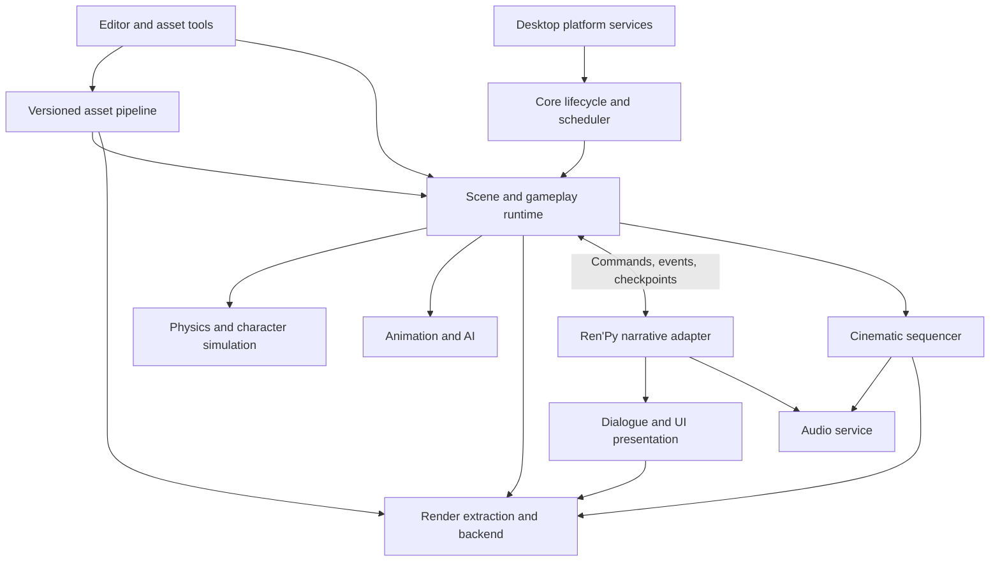

# CORDEL architecture proposal

Status: proposal based on [the source audit](ARCHITECTURE_AUDIT.md), now informed by
the isolated [Phase 1.1 reference viewport](PHASE_1_1_VIEWPORT.md) and
[Phase 1.2 native host](PHASE_1_2_NATIVE_HOST.md).
The proposed production subsystems/interfaces below remain unimplemented.
CORDEL's focus is cinematic third-person narrative games; budgets and integration
cost must drive scope before feature breadth.

## Runtime ownership decision

| Direction | Strengths | Costs and risks | Assessment |
| --- | --- | --- | --- |
| Ren'Py remains primary runtime; expand displayables/GL renderer | Lowest initial disruption; dialogue, UI, packaging and saves continue working; existing static glTF gives a short viewport path | Nested blocking interactions, global stores, idle/redraw policy, display-tree rendering, no world culling; growing native gameplay integration can become tightly coupled | Useful Phase 1 comparison and near-term prototype; weakest fit for large continuous 3D worlds |
| New native runtime hosts adapted Ren'Py narrative in process | Explicit simulation/render ownership; native scene/physics/animation performance; Python retained for story/tools | Ren'Py is not an externally pumped library; UI/character execution, restart, GIL, save/rollback and native module packaging need adapters or controlled refactoring | Recommended long-term direction, conditional on integration spike results |
| New native runtime and separate Ren'Py process | Strong failure/lifetime isolation; preserve an independently running original engine | IPC latency, input/window/audio ownership, compositing, two-process packaging, coordinated saves and deterministic command acknowledgments | Viable development/reference harness; production use needs measured UX and packaging justification |
| Replace narrative implementation with a new runtime | Small purpose-built integration surface | Loses much of the stated reason for Ren'Py; parser compatibility, rollback, translation and authoring semantics become a new project | Do not choose without evidence that adaptation is more expensive than replacement |

**Recommendation:** make CORDEL's world runtime authoritative for continuous
gameplay and use a Ren'Py-derived narrative subsystem behind an explicit boundary.
Retain the original Ren'Py application as the behavioral reference during migration.
Do not claim existing Ren'Py can simply be called once per frame: Say/Menu execute
interactions synchronously today. Hosting requires an explicit resumable execution
adapter or a measured separate-process bridge.

Accept this ownership decision only after comparing a Ren'Py viewport spike with
a small native host spike, including dialogue wait/resume, window/input ownership,
frame stalls, exception/restart handling and packaging. If adaptation cost exceeds
available resources, retain Ren'Py as primary for a bounded prototype and document
its limits. Do not silently weaken the long-term 3D requirements.

Phase 1.1 demonstrates continuous static 3D rendering, real perspective/depth,
time-based camera movement and an ordinary Say wait using existing Ren'Py facilities.
It also observes cached draws outnumbering simulation updates, prediction-owned
asset eviction, coupled hover/controller input ownership and virtual-aspect resize/
screenshot assumptions. The isolated adapter pins its own importer data and
uses drawable aspect. These are comparison evidence, not a production API.
Phase 1.2's software gate now passes: a C++20/SDL3/OpenGL core reference host
renders the same fixture with independent fixed ticking, interpolation and
deterministic scene/GL owners. Controlled and uncapped render rates still service
the same 60 Hz accumulator. Actual delete calls and zero owner counters are
verified; driver memory reclamation is not. There is no narrative integration.

Native ownership made offscreen EGL surface recreation and draw-queue backpressure
explicit. An unbounded uncapped trial blocked simulation and grew RSS; diagnostic
glFinish bounds work, with separately labeled CPU wait. This remains one thread,
so fixed ticking does not eliminate driver stalls. Relative-mode request/event
tests are not physical mouse evidence. Proceed to Phase 1.3's narrative ownership
experiment; defer the final decision to Phase 1.4. Desktop/device, DPI, driver
residency and production queue/platform evidence remain open.

## Proposed boundaries

All subsystem contracts start as internal interfaces. A stable public plugin ABI
is premature. No dependency is introduced merely to make this diagram real.

| System | Responsibilities and initial interface direction |
| --- | --- |
| Core runtime | Create/configure/run/suspend/shutdown; monotonic clocks, fixed update accumulator, job budgets, diagnostics, allocator/resource accounting, platform services. Ordered startup with rollback of partial initialization |
| Rendering | Consume immutable scene/view packets; own GPU resources, uploads, completion fences, resize/device recovery. Camera/mesh/material/light handles; capability query. Eventually PBR, shadows, HDR, post-processing; advanced features only after profiling |
| Scene | Stable entity IDs with generation checks, parented local/world transforms, sparse typed components, scene instantiate/destroy, serialization and reference repair. Enforce acyclic hierarchy and consistent units |
| Characters/animation | Character motor distinct from rendering; locomotion parameters, root-motion policy, skeletal pose buffers, state-machine transitions, blend trees, retargeting and IK layers. Physics and animation agree on authoritative motion |
| Physics | `step`, queries/raycast, shape/body/trigger handles, collision-layer filters and ordered contact events. Character sweeps/traversal are gameplay-visible; no pointers exposed to scripts |
| Gameplay | Player action processing, interaction queries, object/encounter state machines, gameplay events and future combat. Engine services separated from game-specific weapon/rule logic |
| Narrative | Run a label/session, supply immutable world facts, emit commands and dialogue/choice requests, acknowledge waits, checkpoint/restore story state. Preserve localization IDs and compatible reference behavior where deliberately supported |
| Cinematics | Time-based tracks for cameras, poses, dialogue and events; bindings by stable IDs; enter/seek/skip/exit with explicit ownership handoff and interruption policy |
| Audio | One ownership layer for voice/music/world emitters; listener poses, buses/mixing, asset handles, playback clocks and cue acknowledgments. Resolve duplicate device/mixer ownership before embedding Ren'Py |
| AI | Navigation data/queries, perception stimuli, behavior/state evaluation, encounter control and animation requests. Budget updates; gameplay remains authoritative over decisions |
| Assets | Source manifest, stable IDs, import/cook/cache with dependency hashes, versioned runtime data, streaming/residency and packaging. Separate authoring formats from runtime formats |
| Editor | Scene/lighting/character placement, asset browser, inspectors, undo transactions, play-in-editor isolation, cinematic timeline and narrative debug state. Use the same scene/asset schemas as runtime |
| Platform | Desktop window/surface/input/files/timing/threading, suspend and capabilities. Preserve portable interfaces; Linux/Windows first, macOS after a viable backend route; other platforms require separate evaluation |

### Scheduling, memory and ownership

Proposed frame order: collect OS events → update action snapshots → process queued
narrative commands → bounded fixed world/physics ticks → animation/AI/cinematic
updates → publish scene render snapshot → compose UI and submit rendering/audio
cues → service bounded asset/background jobs. A presentation rate different from
the fixed tick uses interpolation. Use a monotonic clock, cap catch-up after long
stalls, and clear held inputs on focus loss. The initial fixed-rate candidate is
60 Hz; measure before adopting it as a content contract.

Renderer owns GPU handles and fence-delayed destruction; simulation owns world
objects and generational IDs; asset service owns immutable cooked data and refcounts;
Python owns narrative state. Explicit RAII lifetimes and memory budgets are more
valuable initially than a custom global allocator. Native systems must not depend
on Python GC finalizers for GPU/physics teardown. Keep Python out of per-vertex,
per-bone and per-contact hot loops; batch facts/commands across the boundary.

Begin with one simulation thread and controlled graphics ownership. Add job/thread
parallelism only after profiling. No worker thread calls Ren'Py UI/global state.
Treat Python GIL ownership and reentrancy as explicit embedding rules; a
background thread does not make its synchronous interactions nonblocking.

### Narrative/gameplay protocol

Define versioned logical messages, independent of in-process versus IPC transport:

- `WorldFact`: stable object/story ID, revision, typed value and simulation tick.
- `NarrativeCommand`: session/sequence ID, command ID, target ID, typed payload,
  and completion policy. Examples: dialogue cue, choice request, move-to request,
  cinematic start, interaction enable/disable.
- `GameplayEvent`: ordered event ID, tick and payload; resolve a narrative wait
  by correlation ID rather than recursive calls into the script executor.
- `Checkpoint`: world schema/version, scene ID, narrative state/version,
  asset manifest ID, event watermark and selected cinematic/audio state.

Validate types and target lifetime; commands produce success/failure/cancellation
acknowledgments. Bounded queues need backpressure and deterministic overflow
diagnostics. Event sequence IDs prevent replaying one-shot effects after load.
Session shutdown cancels outstanding waits; script exceptions surface to tools
and release input/camera ownership. Arbitrary script side effects require an
explicit policy; this interface cannot automatically make all existing Python
statements deterministic or rollback-safe.

Save world and narrative at one synchronized safe point. Persist stable IDs and
versioned values, never native handles. Coordinate writes atomically through a
manifest/checkpoint record and reject incompatible schema/asset revisions before
mutating the live scene. Native state and Ren'Py pickle/rollback state need distinct
serialization and coordinated restore. Narrative rollback either restores a world
checkpoint/compensates effects or stops at a declared boundary. Exact behavior
for gameplay autosaves and legacy Ren'Py save compatibility remains unresolved.

### Cinematic handoff and asset contracts

Camera/input/character ownership uses explicit leases: gameplay yields control to
a sequence, the sequence blends in, and completion/cancel/skip restores a defined
state. The same character instance persists across gameplay and cutscenes where
possible. Animation root motion, camera blends, dialogue cues and audio clocks
need a shared timeline; wall-clock callbacks alone are insufficient. Seek/skip
must not repeat side effects or leave camera/input locked.

Choose a documented coordinate convention before the first mesh import: handedness,
up axis, meters, quaternion layout, transform multiplication and color spaces.
Ren'Py's glTF importer applies its own axis/scale conversion; isolate that conversion
in the reference spike. Use glTF 2.0 as an initial interchange candidate, with
offline validation and dependency hashes. Cooked schema versions must be independent
of CORDEL's product version. Keep optional features and content complexity budgets
visible to creators instead of accepting assets the runtime cannot support.

The reference spike provisionally uses glTF's right-handed +Y-up world, -Z camera
forward, metres, row-major matrices acting on column vectors (`P * V * M * p`).
Yaw zero looks -Z; positive yaw turns toward +X (about -Y), positive pitch looks
up. Its `ASSIMP_TO_WORLD` boundary cancels Ren'Py's imported Y reflection at zoom
1; FlipUVs/FlipWindingOrder remain importer operations. glTF quaternion order is
(x,y,z,w), but this translation-only fixture does not test quaternion imports.
The exact boundary and tests are in the [example README](../../examples/cordel_viewport/README.md).
Keep this as an explicit reference convention when comparing the native spike;
do not silently promote it to a permanent serialized engine ABI.

## Technology comparisons (no production selections committed)

| Area/options | Capability and integration | Maintenance, licensing and platform implications | Evaluation gate |
| --- | --- | --- | --- |
| C++ native core + CPython; pybind11 or nanobind bindings; C ABI boundary | High-throughput world/render loops and familiar Python authoring; binding tools reduce manual glue; C ABI helps isolation | CPython PSF, pybind11 BSD-style, nanobind BSD; verify pinned releases/dependencies. GIL, C++ ownership, ABI and bundled extensions remain work | Prototype batched commands/facts, errors and shutdown; compare direct C API versus binding ergonomics |
| Continue Cython/native extensions within Ren'Py | Uses current build model and lowest short-term packaging friction | Ties scheduling/global state to Ren'Py; upstream maintenance and build complexity grow with world scope | Viewport plus frame-time measurement before further runtime expansion |
| Current GL3/GLES renderer or small experimental OpenGL backend | Fastest supported desktop prototype, existing shader/UI paths | Smaller implementation cost; long-term portability/features and resource model constrained. Driver availability differs, especially macOS | Basic camera/depth/resize and frame trace; no API-wide production commitment |
| bgfx versus SDL GPU versus direct Vulkan/D3D12/Metal | bgfx abstracts several backends; SDL GPU offers a modern lower-level GPU abstraction; direct APIs maximize explicit control | bgfx BSD-2-Clause, SDL zlib; verify shader toolchain and backend maturity. Direct APIs need substantial synchronization/shader/platform engineering; Vulkan on macOS needs a translation route | Compare one scene's shader/material, texture upload, UI composition, supported targets and maintenance effort |
| Jolt versus Bullet versus PhysX | Jolt offers modern rigid-body/character facilities; Bullet mature collision/rigid bodies; PhysX broad simulation capabilities | Jolt MIT, Bullet zlib, open PhysX BSD-3-Clause (check release-specific terms). Different character-controller behavior, build size and platform support | Swept character, stairs/slopes, contacts, deterministic event handling, profiling; keep world interface independent |
| Simple typed scene registry versus EnTT versus Flecs | Small registry minimizes initial dependency; EnTT data-oriented C++; Flecs includes querying/scheduling/tooling | EnTT/Flecs MIT; framework semantics affect IDs, serialization and editor. Overbuilding ECS costs as much as choosing one prematurely | Transform hierarchy + spawn/destroy + save/load/reference repair; benchmark representative workloads |
| ozz-animation versus custom animation core versus licensed middleware | ozz supplies optimized skeletal sampling/blending; custom code fits specific needs; middleware can add authoring/retargeting support | ozz MIT (verify pinned version); animation graph/IK/retargeting still need integration. Middleware cost/redistribution/platform rights depend on contract | Two-clip blend, root motion, import fidelity, IK layer and character budget |
| Recast/Detour versus custom navigation | Proven navmesh/path query pipeline versus smaller special-case solution | Recast/Detour zlib; dynamic obstacles, streaming and character sizes still need design | Bake a test level, path around obstacles, invalidate/replan predictably |
| Existing voice queues + miniaudio/OpenAL Soft versus FMOD/Wwise | Small open libraries versus mature mixing/spatial authoring | miniaudio permissive/public-domain-or-MIT options, OpenAL Soft LGPL; commercial middleware requires agreement. No library choice supplies complete dialogue timing/occlusion automatically | One listener/mixer, voice synchronization, positional cues, cancellation and asset licensing |
| Ren'Py launcher versus Dear ImGui versus Qt versus web UI | Launcher reuses project workflows; ImGui efficient native debug/editor prototyping; Qt rich widgets; web UI broad tooling | ImGui MIT, Qt LGPL/GPL/commercial depending components/use, web stack dependency/security/IPC burden | Scene undo/edit/save and isolated preview; native viewport embedding and distribution costs |

Licenses above are initial screening information, not a final dependency inventory.
Verify exact revisions, transitive dependencies, enabled features and distribution
terms when selecting anything. Compare team effort, source availability and target
hardware as well as feature lists. Do not introduce all candidate libraries.

## Decisions retained for review

1. **Accepted for Phase 0:** additive CORDEL identity/docs; retain upstream packages,
   behavior and notices; no full renderer implementation. Upstream history was
   originally retained, then replaced with fresh CORDEL history at the owner's
   explicit request; the source foundation hash remains documented.
2. **Recommended, provisional:** native world authority with a narrative adapter.
   Decide after scheduling/hosting experiments; record an ADR with measured evidence.
3. **Open:** renderer API/abstraction and minimum hardware; physics/character library;
   scene registry; bindings/CPython packaging; in-process versus IPC adapter; audio
   ownership; animation import/cooking; editor technology; supported desktop matrix.
4. **Open:** narrative rollback in gameplay, atomic checkpoint schema, legacy save
   support, cinematic skip/seek policy, content budgets and target frame rate.

Progress by vertical slices. Phase 1's viewport is not a promise of PBR, full
skeletal animation, collision, editor, or production platform support. Those
features each require their own implementation, measurement and exit criteria.
