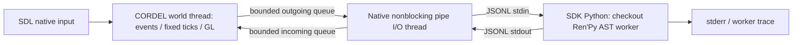

# Phase 1.3 — Narrative Ownership Experiment

Recorded 2026-10-08 UTC. **The Linux software/offscreen ownership gate passes.**
Ren'Py waits, branches, raises an ordinary script exception, or dies while CORDEL
continues rendering and executing its own fixed simulation ticks. This conclusion
covers the deliberately small fixture and measured waits. It does not certify
arbitrary Ren'Py games, production narrative integration or a final hosting choice.
Phase 1.4 remains the next decision gate.

## Git acceptance and scope

Local and fetched `main` matched accepted Phase 1.1
`74ff4155f6a831cf86b26823743ea7fa869ddb09`; local and fetched
`cordel/phase1-native-host` matched `810df7e2d8587a5289cd84873b14467562bef92f`.
The tree was clean. Main was fast-forwarded and pushed to origin without squash,
force, merge commit or ancestry replacement. Phase 1.3 starts there on
`cordel/phase1-narrative-ownership`; publication does not merge this experiment.
Original Ren'Py sources, Phase 1.1 project/asset, prior evidence and notices remain
unchanged. Native additions use optional frame-boundary hooks; ordinary Phase 1.2
runs do not construct a narrative worker or execute Python.

Source and binary hashes, exact commands and the accepted base are recorded in
[evidence/phase1_3/manifest.json](evidence/phase1_3/manifest.json). Focused commits
separate protocol, real worker, native transport, world bridge, probes and tooling.

## Architecture and ownership



| Owner | Responsibility |
| --- | --- |
| CORDEL world thread | SDL window/context, held input, camera, 60 Hz clock, interpolation, world transforms, beacon state, scene/GPU lifetime, presentation decisions |
| Native client/I/O thread | Child process, nonblocking pipe read/write, framing/validation, finite queues; no world/GL pointers or Python interpreter |
| Ren'Py worker process | Real script AST/context execution, labels/branches, dialogue/choice requests, waits, narrative variables, explicit text identity, fixture checkpoint |
| Host termination | Best-effort shutdown, bounded one-second grace, kill fallback, waitpid and thread join before platform/renderer destruction |

There are no sockets, public ports, external services, CPython embedding or IPC
frameworks. Existing CMake/SDL/cgltf versions and licenses are unchanged. Worker
uses the accepted SDK **8.6.0.26100601+nightly.dirty**, Python **3.12.8**, with
checkout source. Build/test tooling uses the existing `.venv`; no host installation.

The worker registers `cordel_worker` through Ren'Py's existing CLI command API.
It loads common/project scripts and initializes translation/stores normally. It
constructs Ren'Py's Interface object, **but never starts it**: every handshake
reports `display_started=false`; session teardown asserts the same. No worker
SDL window/GL rendering or narrative input interaction is started. Worker Say
uses a callable narrator; `store.menu` uses `config.menu_actions=False`, retaining
Ren'Py's real Menu conditions/branch selection while returning its index values.
This bypasses Character display behavior, not AST parsing/execution.

`renpy.game.call_in_new_context` executes Label/Say/Menu/Jump/If/Python/Return.
All story waits are synchronous **inside the worker only**. Native `FrameRunner`
polls SDL, pumps at most eight narrative messages, advances its accumulator,
applies queued commands at fixed ticks, renders and presents. Pipe I/O is on its
own thread. No narrative wait or Python call occurs on the world thread.
The diagnostic harness sleeps 16 ms after completed frames; this is not a new
production pacing policy or a throughput comparison with Phase 1.2.

## Source locations

| Source | Purpose |
| --- | --- |
| [adapter README](../../narrative/phase1_adapter/README.md) | Setup, reproducible gate, console controls and supported scope |
| [schema.json](../../narrative/phase1_adapter/protocol/schema.json), [protocol.py](../../narrative/phase1_adapter/protocol/protocol.py) | Shared field table and worker validation |
| [bootstrap.py](../../narrative/phase1_adapter/worker/bootstrap.py), [service.py](../../narrative/phase1_adapter/worker/service.py) | Actual checkout/SDK startup, narrative execution and wait adapter |
| [script.rpy](../../narrative/phase1_adapter/fixtures/game/script.rpy) | Same narrative AST for headless worker and ordinary displayed reference |
| [narrative.hpp](../../native/phase1_host/include/cordel/narrative.hpp), [client.cpp](../../native/phase1_host/src/narrative/client.cpp) | Process/framing/queue lifetime |
| [json.cpp](../../native/phase1_host/src/narrative/json.cpp), [protocol.cpp](../../native/phase1_host/src/narrative/protocol.cpp) | Bounded native JSON and envelope/payload validation |
| [session.cpp](../../native/phase1_host/src/narrative/session.cpp) | World-thread session state, input modes, command/event/fact bridge, checkpoints |
| [experiment.cpp](../../native/phase1_host/src/narrative/experiment.cpp) | Actual rendered ownership/continuity/failure probes |
| [run_offscreen.sh](../../narrative/phase1_adapter/tools/run_offscreen.sh), [collect.py](../../narrative/phase1_adapter/tools/collect.py) | Build/test/reference/evidence runner |

## Protocol and bounds

Version **`cordel.narrative/0.1`**. UTF-8 JSONL envelopes contain
`protocol_version`, `session_id`, `message_id`, `sequence`, `type`, `payload`;
responses carry `correlation_id`. `control` owns handshake/shutdown; fresh named
sessions own story messages. Sequence increases per sender/process connection.
Session IDs cannot be reused; no pointers, object IDs, pickle or GL handles cross.

Implemented message types:

- `hello`, `hello_ack`, `start_session`, `session_started`, `session_completed`.
- `dialogue`, `dialogue_ack`, `choice`, `choice_result`, `resumed`.
- `narrative_command`, `command_result`, `wait_for_event`, `gameplay_event`, `world_fact`.
- `checkpoint_request`, `checkpoint_data`, `checkpoint_restore`, `checkpoint_restored`,
  `rollback_request`, `rollback_rejected`.
- `cancel_session`, `session_cancelled`, `shutdown`, `shutdown_ack`, `error`, `diagnostic`.

Both validators enforce required field/payload types, version, known types,
correlation presence and nonnegative ordinals. The native service enforces request
ownership/direction and expected response correlations. Worker verifies current
session, request correlation, choice IDs and event identity. Duplicate command IDs
are ignored or answered from the result ledger without repeating the world change.
Duplicate acknowledgements/events and unknown correlations do not advance a wait.
Stale sessions are rejected/ignored; out-of-order sequences fail explicitly.

The schema is a compact field-contract table, **not** a general JSON Schema engine.
Additive extra fields are permitted; unknown message types/version are rejected.
JSON decoding rejects duplicate keys, malformed syntax, nonfinite values, invalid
UTF-8, oversized lines and excess nesting. Doubles serialize with round-trip
precision, so large exact-range sequence values are not rounded by logging code.

Limits: **16,384 bytes/line**, **32 nesting levels**, **64 incoming/outgoing
messages each** (plus one bounded partial read/write), **eight consumed/frame**;
256 received IDs/session, 32 host pending requests, 64 reply timestamps and
128 retained latency samples. Command results are bounded by the received-ID
ledger. At most 128 distinct sessions/worker lifetime. Overflow ends transport,
records its cause and requests SIGKILL on the world thread without waiting;
reaping/join occurs at teardown. These bounds apply to adapter buffers, not total
Ren'Py/Mesa process memory or arbitrary Python script allocations.

## Executed story, presentation, input, commands and events

Opening `Can you still hear me?` (`cordel_opening`) → native command
`set_beacon_enabled(tall_gold,true)` → correlated `beacon_reached` wait → `Good.`
(`cordel_good`) → Menu Continue/Stay → real Ren'Py branch and Python variable
mutation → `We continue.` / `We stay.` → Return/completion.
Continue produces `outcome=continue,counter=1`; Stay produces `stay,2`. Both match
ordinary Ren'Py execution of the **same** script, using normal Character and Menu
screens with test-only dismissal timers. Dialogue order, outcome, variable and
completion are compared automatically, not inferred from similar fixture prose.

Mode A logs dialogue/text IDs and makes host-side acknowledgements. Optional
Mode B prints native console dialogue/choices; Enter acknowledges and 1/2 select.
No production UI is built. SDL queued Enter/1, focus loss/regain and W were tested
through the normal platform dispatch. Physical keyboard/desktop behavior remains
unverified. Explicit modes are Gameplay, NarrativeAcknowledge, NarrativeChoice;
**WASD remains gameplay-owned in all three**, with Enter/1/2/F9 routed separately.
Focus loss clears held/analog state and pending presentation keys. Cancellation,
completion and failure release narrative mode and clear gameplay actions/capture.

The gold column starts hidden in the narrative probe. Command target validation
and `Renderer.set_visible` change its actual draw participation at a fixed tick.
Readback images before/after differ. ACK contains success and native tick. A real
worker deliberately repeats the command ID; the apply count increases exactly
once. Invalid target returns failure and becomes a useful script/session error.
The scene asset remains the original seven-mesh/84-triangle fixture and all GPU
objects are still native-owned.

The automated host sends the gameplay event after its deliberately held native
wait; beacon-enabled state is required. Interactive mode uses camera proximity
within 2 m of (3,2.5,-5). Wrong event/unknown correlation/duplicate event do not
resume the story. A Boolean immutable `beacon_enabled` fact carries revision and
simulation tick; narrative receives it and completion confirms its value.

## Measured simulation continuity and latency

All results below are **SDL offscreen, Mesa 25.0.7 llvmpipe software**, Debian
13.6 x86_64, native OpenGL 4.5 core, 850×480. No visible desktop, physical
controller, hardware/GPU timing or monitor presentation evidence is claimed.
No GPU queries were added. Worker RTT is from its own monotonic clock; native
ACK-to-resume-observation RTT is from the native clock only. No timestamps from
separate processes are subtracted.

| Held state | Wall s | Fixed ticks | Render frames | Dropped s | Worst interval ms |
| --- | --- | --- | --- | --- | --- |
| dialogue | 0.40760 | 24 | 24 | 0 | 17.174 |
| wait_for_event | 0.40912 | 24 | 24 | 0 | 17.387 |
| choice | 0.41009 | 25 | 24 | 0 | 17.605 |
| dialogue (explicit pause) | 0.40744 | 0 | 24 | 0 | 17.113 |
| dialogue (after resume) | 0.41068 | 24 | 24 | 0 | 18.852 |

Held W moved **1.200 m** during dialogue and **1.250 m** during
choice. Every measured wait remained pending. Short-window tick counts include
accumulator endpoint effects; they do not redefine the configured 60 Hz rate.

| Native ACK → worker resume observed | N | Mean ms | Median ms | Worst ms | p95 ms |
| --- | --- | --- | --- | --- | --- |
| choice | 8 | 17.354 | 17.404 | 17.625 | not reported |
| dialogue | 27 | 17.338 | 17.262 | 18.126 | 17.822 |
| narrative_command | 12 | 17.158 | 17.186 | 17.435 | not reported |
| wait_for_event | 8 | 17.360 | 17.278 | 17.783 | not reported |

**55** round-trip samples. Worker death detection: **34.631 ms**;
then **20 frames / 21 ticks** completed. Queue-overflow recovery also completed
**20 frames / 21 ticks**. Native peak RSS stayed at **71,400 KiB**
before/after the finite flood. SIGKILL is explicit in its transport report;
a later teardown needed no additional forced kill. `worker_eof` means actual pipe
EOF; `io_stopped` also covers local validation/overflow failure.

Raw records: [continuity](evidence/phase1_3/continuity-results.json),
[latency](evidence/phase1_3/latency-results.json),
[failures](evidence/phase1_3/failure-results.json) and
[backpressure](evidence/phase1_3/backpressure-results.json).

The worker RTT includes deliberate acknowledgement/event delays. Native RTT
includes queueing, worker execution and the next world-thread message pump;
it is **not bare pipe latency**. Only the 27-dialogue group supports a reported
p95; other groups have fewer than 20 samples. The real-time gain established here
is independent ownership, not a marketing performance ratio.

Explicit `pause_world` freezes only simulation. Events, presentation, rendering
and protocol continue. `resume_world` executes at the world-thread control boundary
while paused; the accumulator was reset during pause, so resume has no large
catch-up debt. Cancellation/failure also clears pause. Ordinary story waits
never request pause. The same native clock retains its three-tick stall bound.

## Cancellation, failure and worker lifetime

Cancellation passes during dialogue ACK, gameplay-event and choice waits; worker
responds with zero pending requests **after** context unwind. Host releases input
mode and clears pending/correlation state; late responses do not resurrect the
session. Retired session IDs cannot restart it. A new session works afterward.

A source review found an important Ren'Py integration detail: `run_context` cleans
dynamic variables for normal return/Exception, while adapter control exceptions
use BaseException to avoid interactive error UI. The adapter explicitly tracks
and cleans that context's dynamic roots and verifies restored stack depth. This
is exercised for cancellation, checkpoint restore and script failure. Context
cleanup is evidence of a safe fixture boundary, not arbitrary rollback support.

The deterministic Python RuntimeError and invalid native target fail only the
session. World ticks/rendering continue; worker remains available for later
sessions. Killing the worker produces EOF/process-death detection and releases
outstanding waits/input. Corrupt/oversized/wrong-version/unknown-type/sequence/
payload messages fail native transport safely; worker malformed input produces
controlled errors, with oversize ending its transport. Native shutdown while a
worker waits reaps the child; no process remains. Responsive shutdown succeeds
without an extra forced kill; explicit death/corruption probes record their kills.

A finite 4096-message emission stress saturates the incoming queue at exactly 64.
The native host reports overflow, ends that connection and requests termination
without waiting in its world loop. Post-failure rendered frames/ticks continue.
Peak native RSS is measured before/after; unchanged peak is short-run evidence,
not a total-process allocation proof or long-soak result. Driver memory release
is outside resource counters. All native GL owner counts return to zero at unload.

## Coordinated checkpoint and rollback boundary

At `cordel_choice_boundary`, checkpoint captures native beacon state, authoritative
camera, simulation tick, fact revision, command count and event watermark; narrative
captures schema/session ID, safe label, outcome, counter, facts and declared
world-effect boundary. Captures are joined when worker data reaches the world
thread at a held narrative boundary; no atomic production save format is claimed.

The experiment advances to final dialogue with Continue, disables the actual
native beacon, moves the camera and changes the event watermark. Restore unwinds
the worker Context and resumes the named choice label, restores native state/camera,
resets clock interpolation debt, and verifies fresh worker checkpoint data returns to unset/0 before
choosing Stay. Native tick resumes from its captured value; diagnostics separately
count executed ticks. The beacon command is never replayed. Checkpoint is valid
only for this fixture and current session, not arbitrary execution stacks/saves.

General rollback is disabled. `rollback_request` is explicitly rejected across
the declared world-effect boundary. No compensation or legacy rollback compatibility
is inferred. No native pointers/GPU resources are serialized.

## Reproducible checks and regressions

From repository root after accepted BOOTSTRAP setup:

```sh
bash narrative/phase1_adapter/tools/run_offscreen.sh tmp/phase1_3-gate
bash native/phase1_host/tools/run_offscreen.sh tmp/phase1_3-native-gate-regression
bash examples/cordel_viewport/tools/run_offscreen.sh tmp/phase1_3-renpy-regression
bash examples/cordel_viewport/tools/check_baseline.sh tmp/phase1_3-renpy-baseline
```

Use new directories on replay. Expanded build flow remains:

```sh
export PATH="$PWD/.venv/bin:$PATH"
cmake -S native/phase1_host -B build/phase1-host -DCORDEL_OFFSCREEN_ONLY=ON
cmake --build build/phase1-host -j 4
ctest --test-dir build/phase1-host --output-on-failure
SDL_VIDEODRIVER=offscreen LIBGL_ALWAYS_SOFTWARE=1 \
  timeout 90s build/phase1-host/cordel-native-host --narrative-test --output tmp/new-narrative-gate
```

All four wrapper commands exit **0**. Final native build reports no warnings.

| Executed group | Result |
| --- | --- |
| CTest | 4/4 targets: 304 original assertions, shared goldens, 23 native protocol/JSON assertions, 5 Python protocol tests |
| Python protocol + real Ren'Py worker suite | 14 tests passed (includes those same 5 protocol tests) |
| Native narrative ownership gate | 186 assertions passed |
| Ordinary displayed Ren'Py reference | Continue and Stay match dialogue, outcome, counter and completion |
| Context unwind trace | 15 records; stack depth restored; zero dynamic roots remaining |
| Phase 1.2 regression | 112 graphics/runtime assertions, five zero-owner scene cycles, full host recreation |
| Phase 1.1 regression | 31 helpers, 83 runtime checks, UI testcase with 8 assertions / 2 hooks |
| Original baseline selection | 29 source + 89 selected SDK tests; two ending tests; lint exit 0 |

Transcripts and machine records are in [evidence/phase1_3](evidence/phase1_3/README.md).
The Phase 1.2 gate was replayed again on the final native binary. Phase 1.1 and
its baseline source are unchanged after their recorded passing replays.

Known full-suite audio/SDK/history-click failures remain unchanged and separate.
The 29-source and 89-SDK selections overlap. Source-native Ren'Py compilation
remains blocked by its wider native development dependencies; this adapter uses
the accepted nightly modules rather than claiming those modules were rebuilt.

## Friction, limits and implications for Phase 1.4

1. **Ownership works at this boundary.** Blocking Ren'Py execution is isolated;
   native world state/input/resources never yield authority to its interaction loop.
   Native fixed ticking is independent of worker scheduling. It remains a
   single world/GL thread, so driver or host stalls still delay native ticks.
2. **The adapter is fixture-scoped.** Real AST semantics/branches/explicit IDs
   are retained; ADVCharacter text pacing, full menu UI behavior, translation
   switching, voice, audio/mixer, screen language and arbitrary script compatibility
   are not bridged. This is substantially less than production Ren'Py integration.
3. **Headless is not a lightweight extraction.** Common scripts/global stores,
   Interface object and broad SDK/native modules still initialize. Internal
   context/dynamic cleanup assumptions require maintenance across upstream updates.
4. **Separate-process packaging and latency are real costs.** One worker/active
   session, serial story execution, Linux-specific pipe2/posix_spawn transport,
   process startup, SDK footprint and roughly one frame of observable reply latency.
   No Windows/macOS deployment or in-process/GIL/reentrancy comparison was executed.
5. **Checkpoint and rollback remain narrow.** Named safe labels and primitive
   fixture state are restorable; arbitrary saves, atomic durable writes, distributed
   checkpoint transactions, rollback compensation and full story migration remain open.
6. **Queue/resource evidence has limits.** Finite failure buffers and CORDEL GL
   owners are proven, not sandboxing arbitrary Python, total worker memory, long
   soaks, physical GPU residency or a production asynchronous GL frame queue.
7. **Presentation/device scope stays open.** No production dialogue UI, subtitles,
   spatial audio, lip sync, cinematic sequencer, physical controller/relative mouse,
   desktop/DPI or hardware performance was added/verified.

The core question has a measured **yes for this reference fixture**: a Ren'Py
narrative subsystem can wait, branch, fail or terminate while CORDEL keeps its own
clock and world. This makes the ownership boundary materially clearer than
sharing Phase 1.1 interaction/keymap/cache ownership. It does **not** decide whether
separate-process hosting is the best production cost/UX trade-off.

Ready for **Phase 1.4 — Runtime / Narrative Architecture Decision Record**. Compare
Ren'Py-primary, native plus in-process adapter, native plus isolated worker and a
deeper narrative refactor/replacement, using all three reference experiments and
the remaining device/packaging/compatibility costs. Phase 1.4 is not implemented
or decided here.
